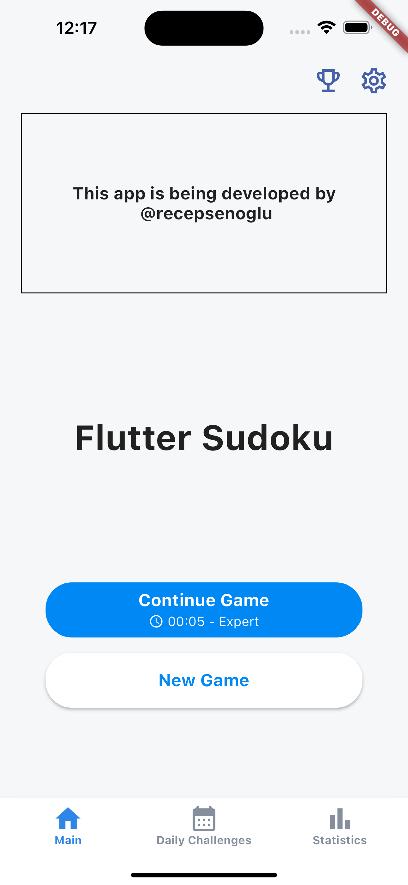
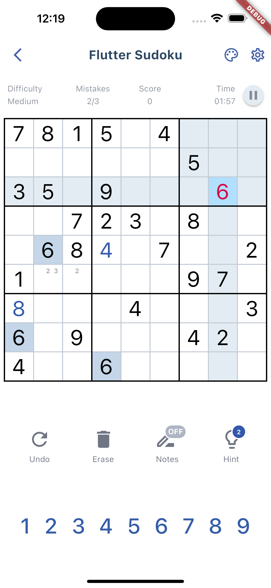
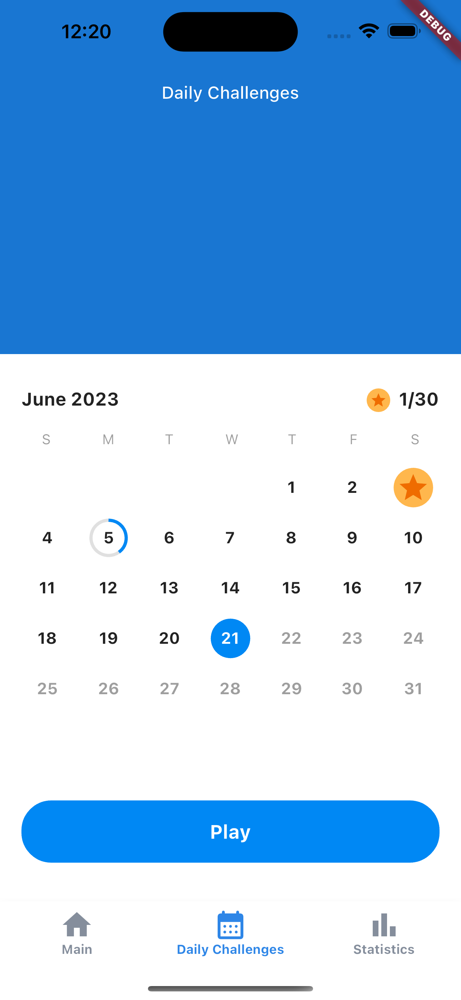
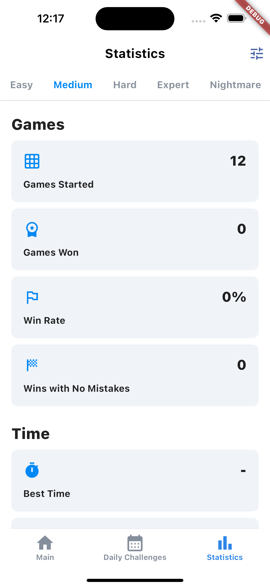
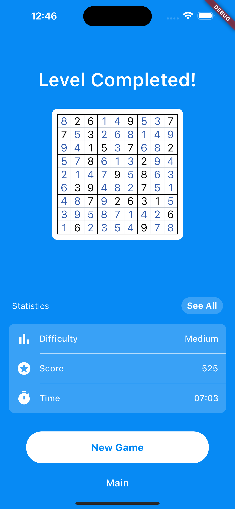
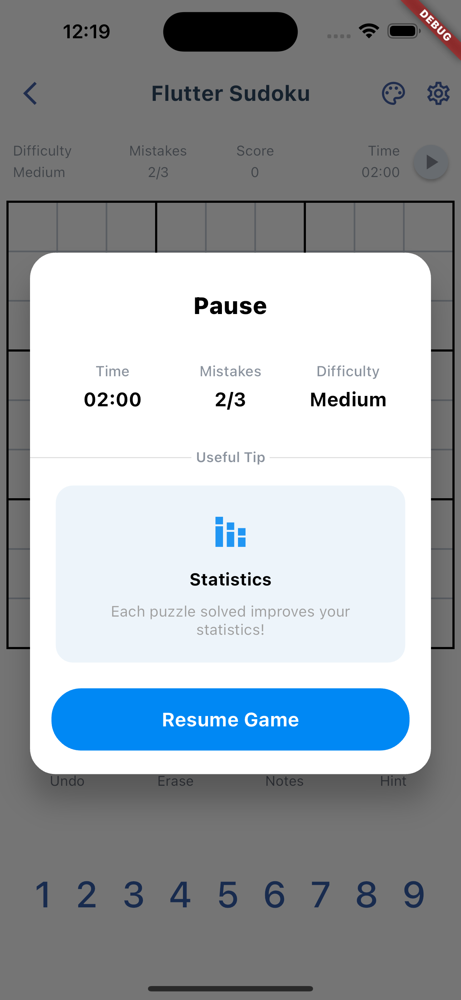
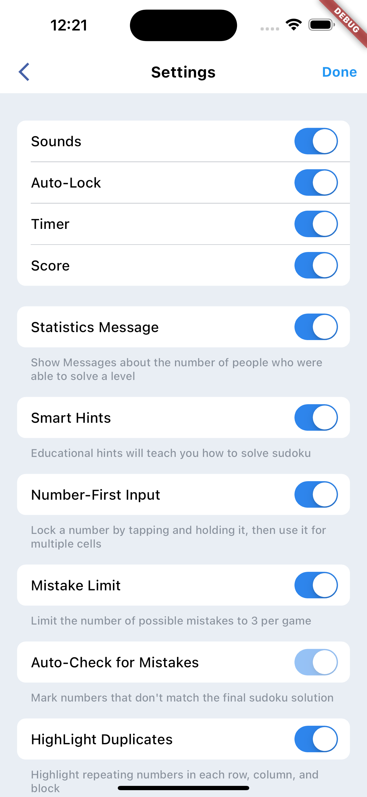
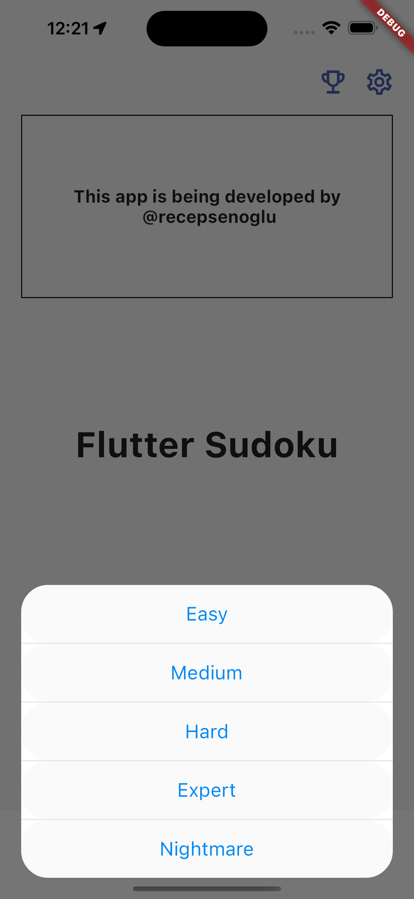

# Flutter Sudoku Game App

A Sudoku game app built with Flutter. The app is still under development.

## Getting Started

### Dependencies

- Flutter
- Dart

## Installation

Clone the repository and run the following command:

```bash
flutter pub get
```

## Usage

Run the following command to run the app:

```bash
flutter run
```

## Screenshots

HomeScreen | GameScreen | Challenges... | Statistics.....|
| :---: | :---: | :---: | :---: |
 |  |  | 


| WinScreen.. | PausePopup | Settings...... | Difficulties.. | 
| :---: | :---: | :---: | :---: |
|  |  |  |  |

## Contributing

Pull requests are welcome. For major changes, please open an issue first to discuss what you would like to change.

## Roadmap

- Complete the Daily Challenges page
- Add a feature to select the theme of the game
- Add a feature to select the language of the game
- Add a feature to share the game
- Add a feature to play with AI
- Add a feature to play with online players

## License

This project is licensed under the MIT License - see the [LICENSE.md](https://github.com/recepsenoglu/flutter_sudoku/blob/main/LICENSE) file for details.
